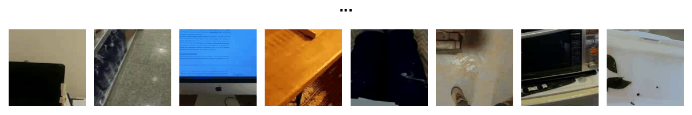
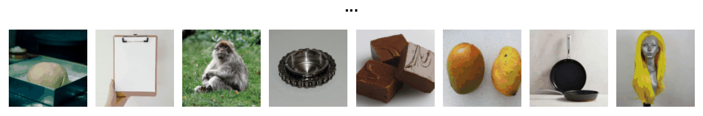
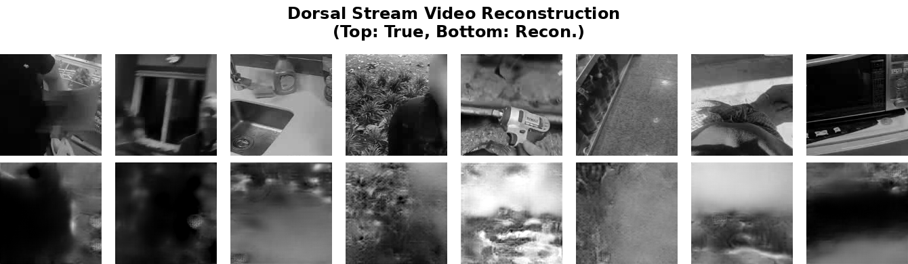

# STSBench: A Large-Scale Dataset for Modeling Neuronal Activity in the Dorsal Stream
📊 [Dataset](https://www.kaggle.com/datasets/ethantrepka1/stsbench/)
<p align="center">
  
</p>

<p align="center">
  
</p>

<p align="center">
  
</p>

<p align="center">
  
</p>

We present STSBench, a large-scale dataset for modeling neuronal response in the dorsal stream. We show that our dataset can be used for: 
1. Benchmarking encoding models of dorsal stream responses.
2. Reconstructing visual input from neural activity in the dorsal stream.
3. Comparing the features of the visual world extracted by the dorsal and ventral visual streams.

We provide code necessary to reproduce our results, and encourage others to build upon our baseline models and to use STSBench in their own work. 

## Repo organization 
The `encoding` and `reconstruction` directories contain the code for training and evaluating encoding and reconstruction models, and the `plotting` directory contains code for visualizing results and constructing tables. Preprocessing scripts for constructing STSBench from raw data are in `preprocessing` - these are provided for reference as the dataset is the output of these preprocessing steps. See the repo structure section below for more details. 

## Requirements

To install requirements:

```setup
pip install -r requirements.txt
```

To setup with Docker: 
```setup
docker compose run -p 0.0.0.0:10116:8888 -d -e CUDA_VISIBLE_DEVICES=0 --name mt_bench jupyter_dev --gpus '"device=1"'
```

To access Jupyter Lab in the container, navigate to localhost:10116 with the password 1234. 

### Downloading and preprocessing STSBench
We provide preprocessed neural data and metadata in this repo for conveinence. To train and evaluate dorsal stream encoding or reconstruction models, you need to download the corresponding stimuli from the [STSBench dataset](https://www.kaggle.com/datasets/ethantrepka1/stsbench/) and place them in `dataset/dorsal_stream/`. 


### Downloading and preprocessing TVSD
We provide preprocessed neural data from the Things Ventral Stream Dataset (TVSD) in this repo for conveinence. To train and evaluate ventral stream reconstruction models, you need to download the images from the [THINGS image dataset](https://osf.io/jum2f/) and run `preprocessing/preprocess_ventral_dataset.ipynb` to convert the images into .mp4 videos in a directory called `dataset/ventral_stream/`. Note that you just need to specify the appropriate path to the THINGS dataset and run the last cell in the notebok to do this. The other cells in the notebook are for preprocessing the neural data from TVSD. 


## Training

To train all the encoding models in the paper with a grid search over hyperparameters, run this command:

```train
sh grid_search_all.sh
```

To train the diffusion reconstruction models in the paper, run these commands:
```train
python3 train_vqvae.py --config configs/dorsal_stream_diffusion.yaml
python3 train_ddpm_cond.py --config configs/dorsal_stream_diffusion.yaml

python3 train_vqvae.py --config configs/ventral_stream_diffusion.yaml
python3 train_ddpm_cond.py --config configs/ventral_stream_diffusion.yaml

python3 train_vqvae.py --config configs/dorsal_stream_diffusion_video.yaml
python3 train_ddpm_cond.py --config configs/dorsal_stream_diffusion_video.yaml
```

## Evaluation

To evaluate one encoding model on STSBench, download the encoding model checkpoints (see below) and dataset, then run the following command:
```eval
python3 test.py --config ./configs/dorsal_stream_simple3d5.yaml
```
Any of models can be substituted for simple3d5 (the 3D CNN-1 model) here by replacing the config.


To evaluate the reconstruction diffusion models on STSBench, download the reconstruction model checkpoints (see below) and dataset, then run the following commands:
```eval
python3 sample_ddpm_cond.py --config ./configs/dorsal_stream_diffusion.yaml
python3 eval.py --config ./configs/dorsal_stream_diffusion.yaml
```

## Pre-trained Models

You can download pretrained encoding and reconstruction models here: 
- [STSBench Checkpoints](https://drive.google.com/drive/folders/19KkKTJGfAbZ_YkHZNka8xs5i_P1jgpgZ?usp=sharing)
- The `encoding_checkpoints` folder should be renamed `checkpoints` and placed in the `encoding` directory as indicated above.
- The `reconstruction_checkpoints` folder should be renamed `checkpoints` and placed in the `reconstruction` directory as indicated above.

The configs used to train the encoding models are in `encoding/configs`, and the loss function hyperparameters used for training were determined via a grid search and are specified separately in the corresponding `encoding/logs/*_grid.npy` file. The configs used to train the reconstruction models are in `reconstruction/configs`. 

## Results

Our encoding models achieve the following performance ($R^2$ on test set) at predicting neuronal firing rates, averaged across neurons in the dataset:

| Training Scheme | Model name         |    $R^2$        |
|-----------------| ------------------ |---------------- | 
| End-to-end      | 3D CNN-5           |    0.338        | 
| Pretrained      | 3D ResNet-Kinetics |    0.303        | 
| Pretrained      | 3D ResNet-Motion   |    0.289        | 
| Hand-tuned      | 3D Gabor           |    0.266        | 
| Pretrained      | 2D ResNet-ImageNet |    0.185        | 

See the associated paper for a detailed description of each model. 

Our diffusion models acheive the following performance (LPIPS and PSNR on test set) at reconstructing images from neuronal activity: 

| Dataset     |   PSNR   |  LPIPS    |
|-------------| -------- |---------- | 
| STSBench    |   14.16  |   0.67    | 
| TVSD        |   10.63  |   0.59    | 

See the associated paper for a detailed description of each model, and additional comparisons to null models and baselines.  

## Contributing

The code and models is this repository are released under the MIT License. Images or videos included in this repository for reproducibility purposes and code from other repositories are bound by their original licenses. Please cite the corresponding paper if you use the code or dataset in your work.

## Acknowledgements
1. The diffusion model code is a port of the [PyTorch Stable Diffusion Implementation from Explaining AI.](https://github.com/explainingai-code/StableDiffusion-PyTorch/tree/main)
2. The encoding model readout and training code was adapted from models released with the [Things Ventral Stream Dataset.](https://doi.gin.g-node.org/10.12751/g-node.hc7zlv/)
3. The 3D ResNet-Self Motion and 3D Gabor model code was adapted from [Your Head is There to Move You Around.](https://github.com/patrickmineault/your-head-is-there-to-move-you-around/tree/main)
4. We include the TVSD neural data here for ease of use because it was released under a CC license, but any reuse of this data should cite the [original paper.](https://www.cell.com/neuron/abstract/S0896-6273(24)00881-X?rss=yes)
5. Code for plotting results and making LaTeX tables was written with assistance from ChatGPT. Any LLM generated code was proofread to ensure correctness. 

## Repo Structure

```
├── assets                                          # Gifs to display in README

├── dataset
│   ├── dorsal_stream                                # Drop *.mp4 videos for STSBench here 
│       ...
│   ├── ventral_stream                               # Drop *.mp4 videos for TVSD here 
│       ...
│   ├── dorsal_stream_neuron_table.pickle            # Neuron metadata for STSBench
│   ├── dorsal_stream_dataset.pickle                 # Neural activity & stimulus IDs for STSBench
│   ├── ventral_stream_dataset.pickle                # Neural activity & stimulus IDs for TVSD (V4 subset)

├── preprocessing                                   
│   ├── construct_dataset_neurips.ipynb             # Notebook to construct STSBench dataset
│   ├── postprocess_fixation_rf_neurips.ipynb       # Postprocessing receptive field mapping task data
│   ├── postprocess_fixation_video_neurips.ipynb    # Postprocessing video fixation task data
│   ├── postprocess_neuron_properties.ipynb         # Adding neuron metadata to the dataset
│   ├── preprocess_ventral_dataset.ipynb            # Preprocess ventral stream data from TVSD to the same format
│   ├── run_all.sh                                  # Shell script to execute dorsal stream preprocessing notebooks in order
│   └── utils.py                                    # General utility functions used in preprocessing scripts

├── plotting
│   ├── figures
│       ...
│   ├── tables
│       ...
│   ├── make_table1.py                               # Write encoding metrics to LaTeX table
│   ├── make_table2.py                               # Write reconstruction metrics to LaTeX table
│   ├── plot_encoding_model_arch.ipynb               # Plot example features and predictions
│   ├── plot_encoding_model_perf_layers.ipynb        # Plot performance over layers
│   ├── plot_reconstruction.py                       # Plot reconstructions as figure
│   ├── plot_reconstruction_gif.py                   # Plot reconstructions as gif
│   ├── plot_reconstruction.sh                       # Script to plot reconstructions for selected images
│   ├── plot_rfs_waveforms.ipynb                     # Visual RFs and spike waveforms filters
│   └── visualize_learned_filters.ipynb              # Visual CNN filters in the Conv3D-1 Model

├── encoding                                         
│   ├── baselines                                    # Baseline encoding models
│   │   ├── dorsalnet                                # 3D ResNet - Self Motion model
│   │   │   ├── checkpoints                          
│   │   │   │   └── dorsalnet.pt                     # Checkpoint for 3D ResNet - Self Motion model
│   │   │   ├── dorsal_net.py                        # Model for 3D ResNet - Self Motion 
│   │   │   └── resblocks.py                         # Helpers for 3D ResNet - Self Motion
│   │   ├── gaborpyramid                             
│   │   │   └── gabor_pyramid.py                     # Model for 3D Gabor 
│   │   └── simple3d.py                              # Models for 3D CNNs trained end-to-end
│   ├── checkpoints                                  
│   │   ├── dorsal_stream_dorsalnet_112_res0.pth     # Encoding model checkpoint
│   │   └── ...                                      
│   ├── configs                                      
│   │   ├── dorsal_stream_dorsalnet.yaml             # Config file for 3D ResNet - Self Motion model
│   │   └── ...
│   ├── logs                                         
│   │   ├── dorsal_stream_dorsalnet_112_res0_grid.npy  # Results of grid search
│   │   ├── dorsal_stream_dorsalnet_112_res0_test.npy  # Test set correlation to average
│   │   ├── dorsal_stream_dorsalnet_112_res0_train.txt # Training logs
│   │   └── ...
│   ├── dataloader.py                                # Data loader utilities
│   ├── dataset.py                                   # Dataset class for stimuli and neural data
│   ├── model.py                                     # Readout architecture and generic feature extractor 
│   ├── grid_search.py                               # Script to grid search model with specific config
│   ├── test.py                                      # Script for testing model with specific config
│   ├── train.py                                     # Script for training model with specific config
│   ├── grid_search_all.sh                           # Script to run grid search and eval all encoding models 
│   ├── train_all.sh                                 # Script to train and eval all encoding models 
│   └── utils.py

│── decoding
    └── optic_flow_decoding.ipynb                     # Notebook to train and test optic flow decoders 
                            
└── reconstruction
    ├── LICENSE                                      # License for diffusion model code from Explaining AI 
    ├── checkpoints                                  # Model checkpoints for diffusion and baselines
    │   ├── dorsal_stream
    │       ...
    │   └── ventral_stream
    │       ...
    ├── configs                                      
    │   ├── dorsal_stream_diffusion.yaml              # Model configuration files for diffusion
    │   ...

    ├── logs                                          # Training logs and sampled images for specific models
    │   ├── dorsal_stream
            ...
    │   └── ventral_stream
    │       ...
    │   ├── dorsal_diffusion_LPIPS.npy                # LPIPS metric evaluated for diffusion
    │   ├── dorsal_diffusion_PSNR.npy                 # PSNR metric evaluated for diffusion
    |   ...
    ├── models                                        # LDM components, see Explaining AI
    │   ├── __init__.py
    │   ├── blocks.py
    │   ├── discriminator.py
    │   ├── lpips.py
    │   ├── unet_cond_base.py
    │   ├── vqvae.py
    │   └── weights
    │       └── v0.1
    │           └── vgg.pth                           # VGG checkpoint for LPIPS
    ├── scheduler                                     # LDM noise scheduler, see Explaining AI
    │   ├── __init__.py
    │   └── linear_noise_scheduler.py
    ├── __init__.py
    ├── baselines.py                                  # Linear and CNN baselines and training code
    ├── dataloader.py                                  
    ├── dataset.py
    ├── train_vqvae.py                                # Script to train VQVAE from scratch for LDM
    ├── train_ddpm_cond.py                            # Script to train LDM from scratch
    ├── sample_ddpm_cond.py                           # Script to sample from trained LDM
    ├── eval.py                                       # Script to compute metrics for reconstructions 
    └── utils.py

```
